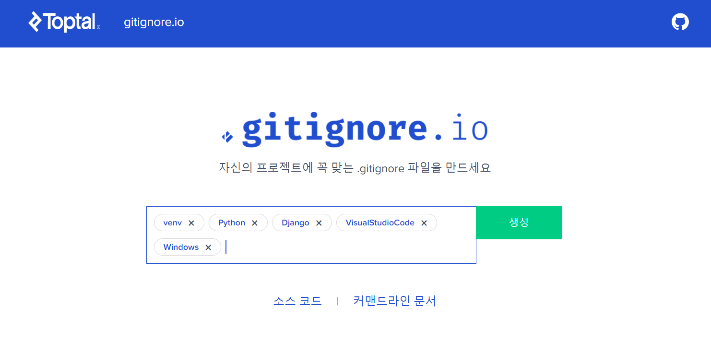
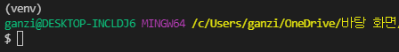
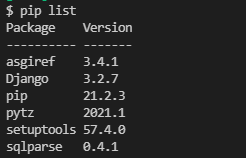
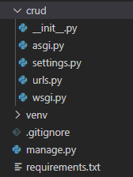
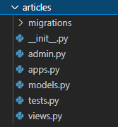
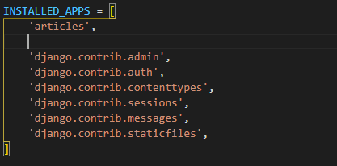
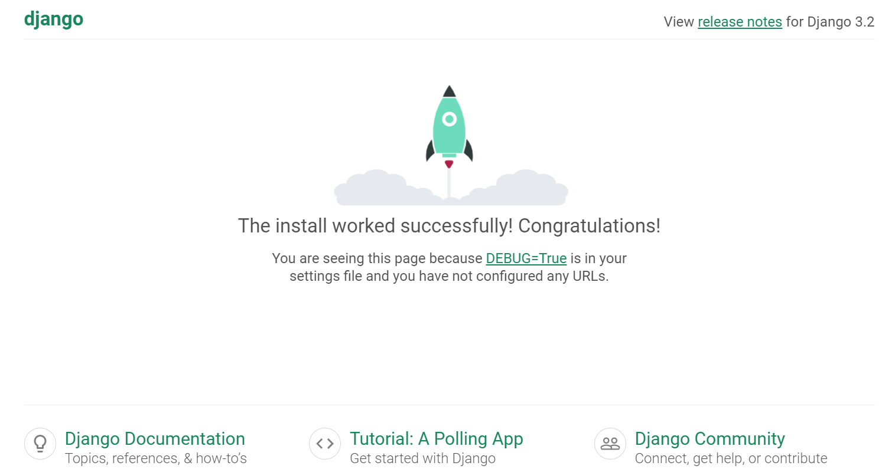
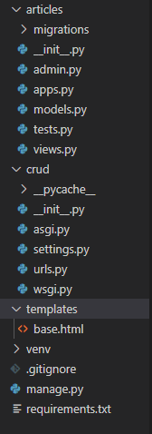
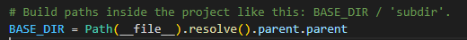
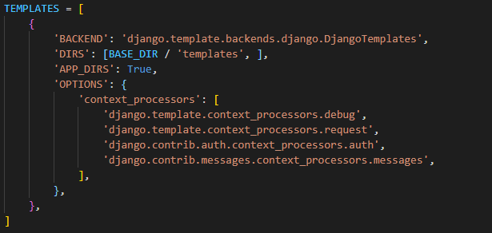

# 📌Django Project Setting(1)


## 사전 설정


### .gitignore

- `.gitignore` (선택)

<https://www.toptal.com/developers/gitignore> 접속 후 프로젝트에 맞는 설정 적용



가상환경을 위한 `venv`, 언어 환경을 위한 `Python`, `Django`, `VisualStudioCode`, `Windows` 추가

생성된 결과를 `.gitignore`파일을 프로젝트 폴더에 생성 후 작성


### 가상환경 venv

- `venv`

bash 창에 venv 생성 커맨드 작성

cmd 창 표시를 위해 `$` 를 해놨으므로, 실제로 bash에 작성을 할 때는 쓰지 말 것

```
$ python -m venv venv
```

가상 환경 활성화

```
$ source venv/Scripts/activate
```



상단에 `(venv)` 표시를 통해 가상환경 활성화 여부 확인 가능


Django 모듈 설치 후 `pip list`를 통해 설치 여부 확인

```
$ pip install django
```

설치된 모듈 확인 방법

```
$ pip list
```




설치된 모듈 리스트를 저장하는 방법(`requirements.txt` 에 저장)

```
$ pip freeze > requirements.txt
```

주어진 모듈 리스트들을 통해 모듈을 설치하는 방법 (`requirements.txt`에 저장되어있다는 가정)

```
$ pip install -r requirements.txt
```


## 📌프로젝트 시작하기

- Project
  - Application의 집합
  - 여러 앱이 포함될 수 있음
  - 앱은 여러 프로젝트에 있을 수 있음


- 프로젝트 이름은 `crud` 로 많이 설정

```
$ django-admin startproject crud .
```

프로젝트가 생성되면, 다음과 같이 `crud` 폴더와 `manage.py` 파일이 생성된 것을 확인할 수 있다.



- `__init__.py`

Python에게 이 디렉토리를 하나의 Python 패키지로 다루도록 지시

- `asgi.py`

Asynchronous Server Gateway Interface

django 어플리케이션이 비동기식 웹 서버와 연결 및 소통하는 것을 도와줌

- `settings.py`

어플리케이션의 모든 설정(중요✔)

- `urls.py`

사이트의 url과 적절한 views의 연결을 지정

- `wsgi.py`

Web Server Gateway Interface

django 어플리케이션이 웹서버와 연결 및 소통하는 것을 도와줌

- `manage.py`

Django 프로젝트와 다양한 방법으로 상호작용하는 커맨드라인 유틸리티


## 📌Application 생성

- Application
  - 실제 요청을 처리하고 페이지를 보여주는 등의 역할 담당
  - 하나의 프로젝트는 여러 앱을 가짐
  - 일반적으로 앱은 하나의 역할 및 기능 단위로 작성


- Application 이름은 복수형 권장

예시는 `articles`로 구현

```
$ python manage.py startapp articles
```

Application이 생성되면, 앱 이름으로 된 폴더가 생성된 것을 확인할 수 있다.



- `admin.py`

관리자용 페이지를 설정

- `apps.py`

앱의 정보가 작성된 곳

- `models.py`

앱에서 활용하는 Model을 정의

- `tests.py`

프로젝트의 테스트 코드를 작성

- `views.py`

view 함수들 정의


### Application 등록

- **반드시 생성 후 등록**
  - 먼저 작성하고 생성하려면 앱이 생성되지 않음
- `settings.py`의 `INSTALLED_APPS`에 추가
  - Local apps, Third party apps, Django apps의 순서로 등록하는 것을 권장




### 정상적인 생성 여부 확인

- 서버실행

```
$ python manage.py runserver
```

- <http://127.0.0.1:8000/> 를 통해 정상적으로 생성되었는지 확인 가능

- 실행 결과




## 📌base.html 생성

- html파일들에서 공통적인 형식이 나타남
- 반복적으로 작성하는 것을 줄이고자 `base.html`생성 

- `templates` 폴더를 생성 후, `base.html` 파일 생성




#### base.html

- Bootstrap을 활용하기 위해, css, js 파일 적용
- `body`쪽 파트에, 내용을 넣고자 `block` 생성 

```django
<!DOCTYPE html>
<html lang="en">
<head>
  <meta charset="UTF-8">
  <meta http-equiv="X-UA-Compatible" content="IE=edge">
  <meta name="viewport" content="width=device-width, initial-scale=1.0">
  <title>Document</title>
  <link href="https://cdn.jsdelivr.net/npm/bootstrap@5.0.2/dist/css/bootstrap.min.css" rel="stylesheet" integrity="sha384-EVSTQN3/azprG1Anm3QDgpJLIm9Nao0Yz1ztcQTwFspd3yD65VohhpuuCOmLASjC" crossorigin="anonymous">
</head>
<body>
  <div class="container">
    
    
  </div>
  
  <script src="https://cdn.jsdelivr.net/npm/bootstrap@5.0.2/dist/js/bootstrap.bundle.min.js" integrity="sha384-MrcW6ZMFYlzcLA8Nl+NtUVF0sA7MsXsP1UyJoMp4YLEuNSfAP+JcXn/tWtIaxVXM" crossorigin="anonymous"></script>
</body>
</html>
```


####  디렉토리 추가

- `settings.py`의 `TEMPLATES`에 디렉토리 추가
- `DIRS`에 추가
- `BASE_DIR`은 가장 앞쪽 디렉토리를 말함
  - 현재 위치의 parent(crud)의 parent



- 추가한 결과



