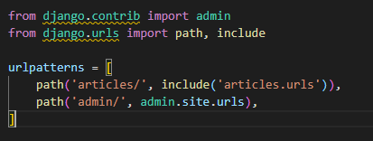
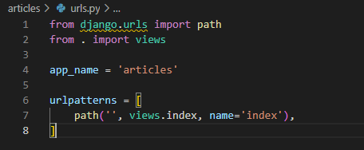
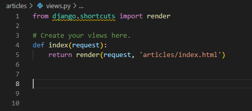
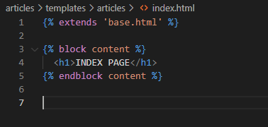

# 📌Django Project Setting(2)

- 경로 설정(`urls.py`)
- `views`를 활용한 연결(`views.py`)
- html 파일 생성


## 📌urls.py

- 각 앱의 url을 분리하여 활용할 예정이므로, `crud`의 `urls.py`에는 앱 이름을 활용하여 경로 생성
- `admin`은 관리자용 페이지
- `articles`가 앱의 페이지들을 말하는데, `include`를 통해 `articles`폴더의 `urls.py`를 끌어오고 있음
  - 기본적으로 생성되어 있는 내용이 아니므로, `articles` 폴더에 `urls.py`파일 생성


#### crud/urls.py




#### articles/urls.py

- `views`와의 연결을 위해, `views`를 import 해야 함
- `app_name`의 경우, 쉬운 url 표기를 위해 사용
- 기본 url 설정을 위해, `''`경로를 `index`쪽으로 연결




## 📌views.py

- `urls.py`에서 만든 내용을 기반으로, 함수를 작성
  - 기본 경로를 위해  `views.index`를 활용하고 있으므로, `index` 함수 생성
- 간단한 예시이므로, 요청에 응답한 리턴값으로 `articles/index.html` 연결


#### articles/views.py




## 📌index.html

- `articles`에 `templates`폴더를 생성하고, 그 안에 `articles` 폴더를 생성 후 `index.html` 생성
  - 앱마다 이름이 같은 html파일이 있는 경우, 다른 앱의 html파일을 열 수 있으므로, 그런 점을 방지하기 위해 앱 이름과 같은 폴더를 `templates`에 생성 후 그 안에 html 파일 작성
- 앞서 SETTING_1 게시글에서 만들었던 `base.html`활용
  - `extends` 활용
- 넣고자 하는 내용은 `block`을 생성하여 그 안에 작성
  - `base.html`에서 `block content`라고 하였으므로, 동일하게 표현


#### articles/templates/articles/index.html




## 📌결과 확인

- runserver를 통해 결과 확인 가능

```
$ python manage.py runserver
```

<http://127.0.0.1:8000/articles/> 의 내용 확인


- 정상적으로 페이지가 나오고있음을 볼 수 있다!


