# Django Project Setting (3) 

- Model 
- Migrations
- 모델 수정


## 📌Model 이란?

- 웹 어플리케이션의 데이터를 구조화하고 조작하기 위한 도구
- 단일한 데이터에 대한 정보
  - 사용자가 저장하는 데이터들의 필수적인 필드와 동작 포함
- 저장된 DB의 구조
- django는 model을 통해 데이터에 접속 및 관리 가능
- 일반적으로 각각의 모델은 하나의 DB table에 mapping


## 📌models.py

- DB 컬럼과 어떤 타입으로 정의할 것인지에 대해 django.db 모듈의 models 상속
  - 각 모델은 django.db.models.Model 클래스의 서브 클래스로 표현

- 사용하고자 하는 모델의 Field 활용은 <https://docs.djangoproject.com/en/3.2/ref/models/fields/> 참조

- 각 변수는 모델의 필드를 나타냄


- `CharField(max_length=None, **options)`
  - 길이의 제한이 있는 문자열 넣을 때 사용
  - max_length는 필수 인자
- `TextField(**options)`
  - 글자의 수가 많을 때 사용


#### articles/models.py

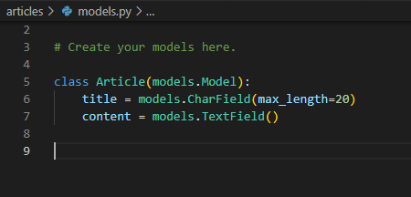


## 📌Migrations

- django가 model에 생긴 변화를 반영하는 방법

- `makemigrations`를 한 이후에 `migrate`을 해야 함


### makemigrations

- model을 변경한 것에 기반한 새로운 migration을 만들 때 사용

```
$ python manage.py makemigrations
```

- `articles/migrations/`폴더에 `0001_initial.py`가 생긴 것을 확인할 수 있음

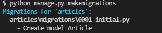

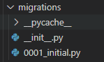


#### articles/migrations/0001_initial.py

- 아래 사진에서 알 수 있듯이, `models.py`에서 만들지 않았던 `id`부분이 같이 생성되고 있는 모습을 볼 수 있음
  - `id`는 각 행의 고유값인 `PK(primary key)`를 위한 값

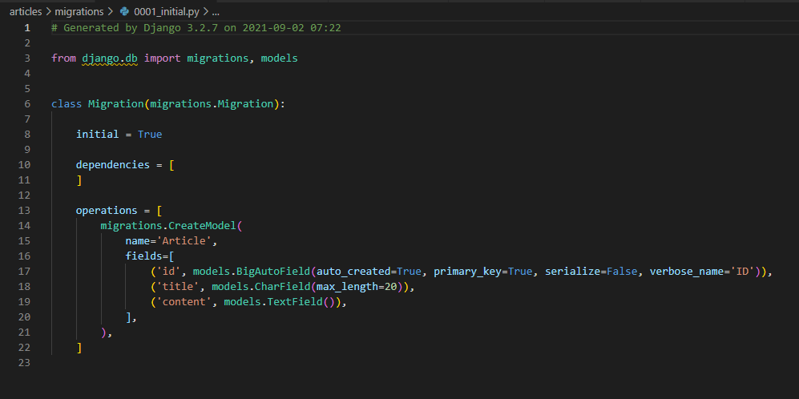


### migrate

- migration을 DB에 반영하기 위해 사용

- 설계도를 실제 DB에 반영하는 과정

```
$ python manage.py migrate
```

커맨드를 실행하면 다음과 같은 결과를 볼 수 있다.

- `0001_initial.py` 설계도가 실제 DB에 반영되고 있음

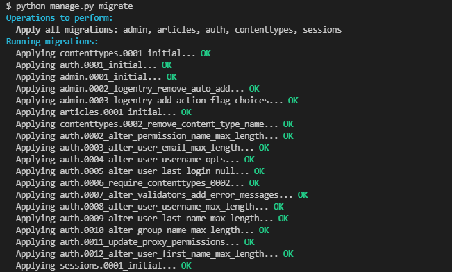


### sqlmigrate

- 해당 migrations 설계도가 SQL 문으로 어떻게 동작하는지 미리 확인

```
$ python manage.py sqlmigrate articles 0001
```

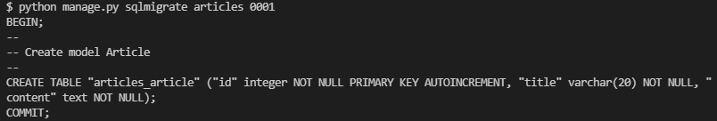


### showmigrations

- migrations 설계도들이 migrate 됐는지 안됐는지 여부 확인

```
$ python manage.py showmigraitons
```

- `X` 표시는 migrate이 되었음을 말함

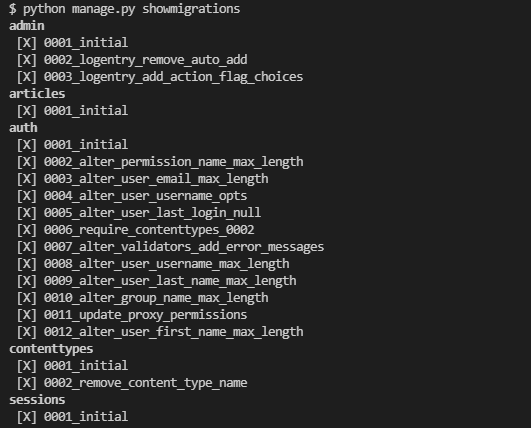


## 📌Model 수정

- 다음과 같이 `models.py`에 추가적인 내용 작성

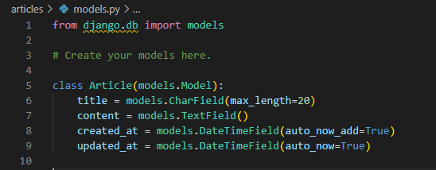

- `auto_now_add`는 최초 생성 일자, `auto_now`는 최종 수정 일자
- model에 변경사항이 발생한 경우, `makemigrations`와 `migrate`을 다시 해주어야 한다.


```
$ python manage.py makemigrations
```

- created_at 필드에 관한 설정이 발생하는데, default 값 활용을 위해 1)을 적용

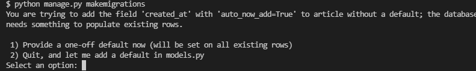

- timezone.now 자동 설정 위해 빈 상태에서`enter`

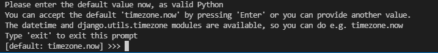

- 결과

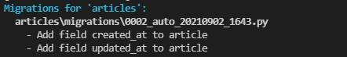


#### articles/migrations/0002_auto_20210902_1643.py

- 생성시간에 따라 파일 이름은 다르게 생성됨

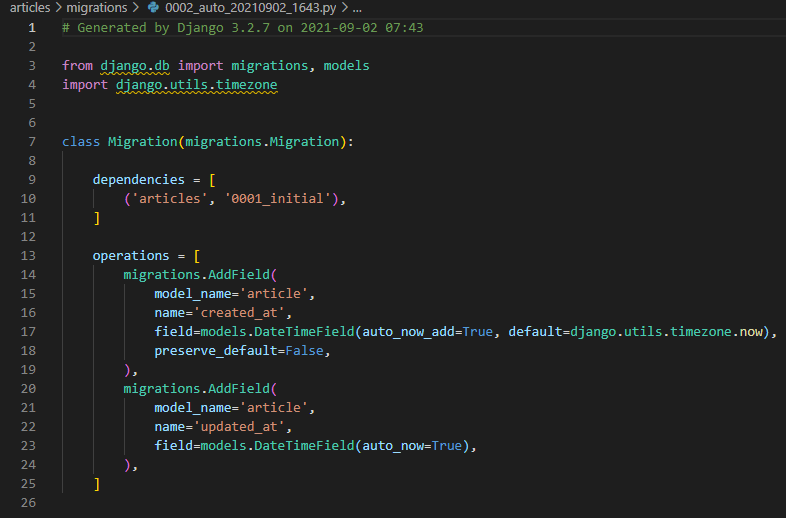


- DB 반영

```
$ python manage.py migrate
```

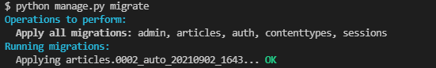

