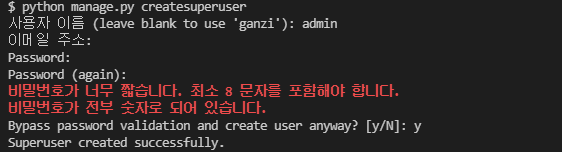
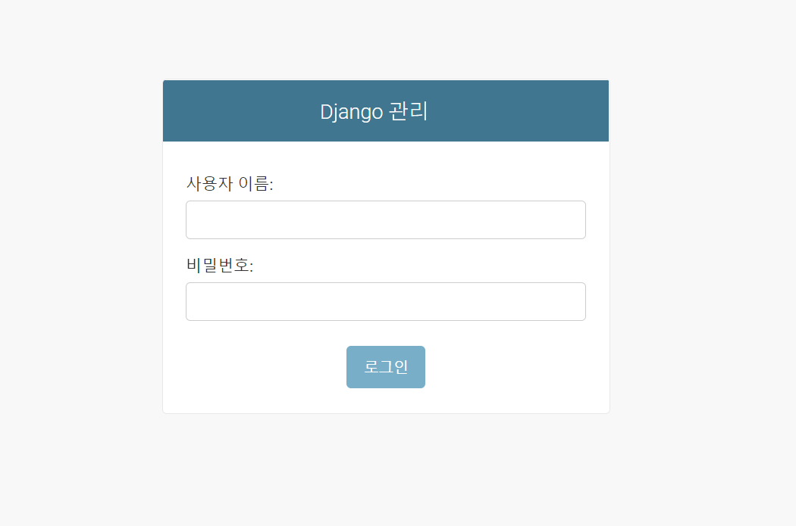
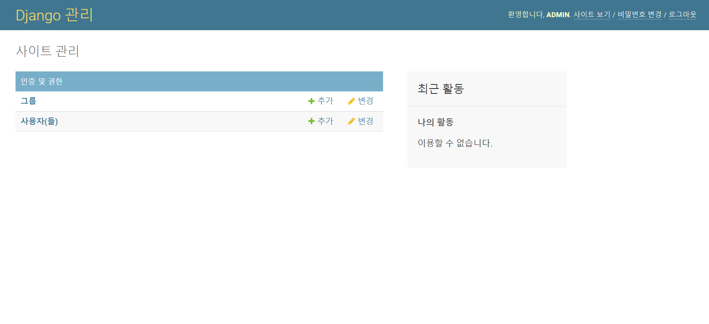
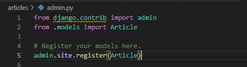
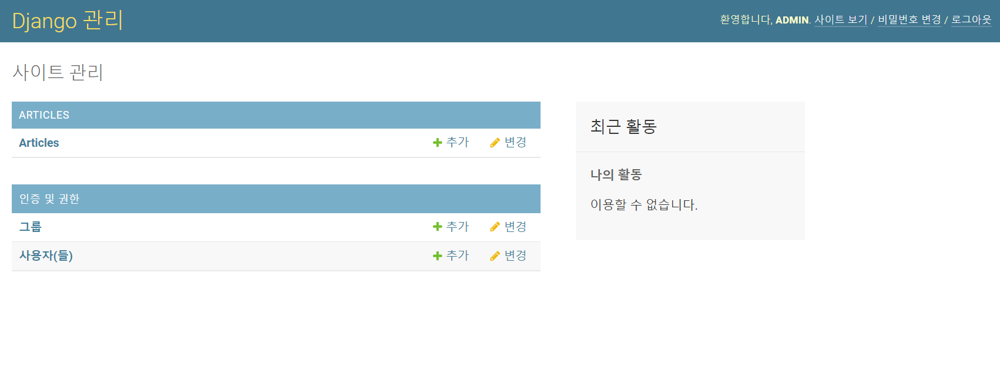
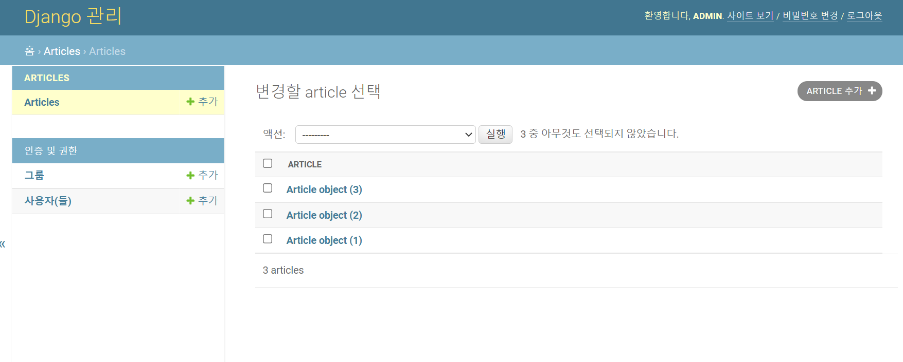
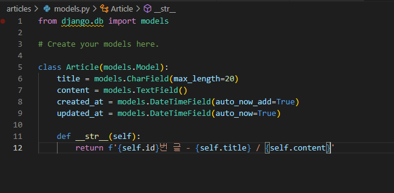
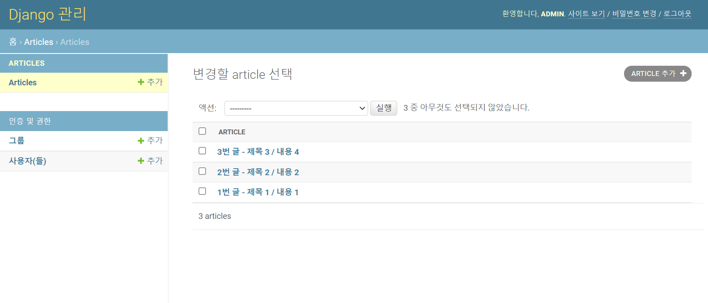
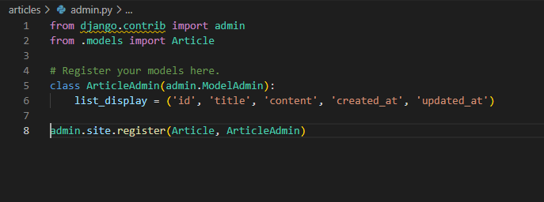
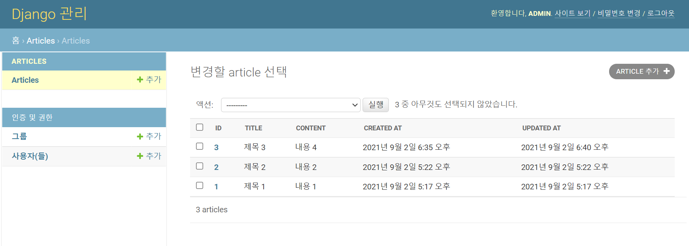

# 📌Django Admin 생성 및 관리

- admin 계정 생성
- 관리자 페이지 접속
- 관리 페이지에서 보이는 내용 변경
  - admin.py 수정


## 📌Admin 계정 생성

- bash에서 명령어를 통해 관리자 계정 생성

```
$ python manage.py createsuperuser
```

- 사용자 이름, 이메일 주소, 비밀번호 입력
  - 이메일 주소는 쓰지 않아도 상관 X
  - 비밀번호는 써도 나타나지 않으므로 주의!
  - 간단한 비밀번호를 작성하면, 아래의 경고메세지가 뜸
    - 진행은 가능




## 📌관리자 페이지 접속

- 기본적인 설정에서는,  <http://127.0.0.1:8000/admin/>을 쳐서 접속 가능
- 접속을 하게 되면, 아래와 같은 창이 뜨는 것을 확인할 수 있다.



- 사전에 만든 관리자 계정 아이디와 비밀번호를 통해 접속
- 아무런 설정도 변경하지 않은 상태라면, 다음과 같이 뜨는 것을 볼 수 있다.




## 📌관리 페이지에서 보이는 내용 변경

- 앱의 `admin.py` 파일 수정을 통해 테이블을 보이게 할 수 있다.
- Model class를 `admin.py`에 등록하고 관리


#### admin.py

- 관리자 페이지에 Article 객체가 관리자 인터페이스를 가지고 있다는 것을 알려줌
- 아래와 같이 표기하면, `models.py`에서 정의한 `Article`클래스의 `__str__` 형태로 객체를 표현



- 사이트에 `Articles`가 생성된 것을 볼 수 있다.



- 아무런 설정이 되어있지 않아, 각 객체를 보기 어려운 상황
- `models.py`에 `Article`의 `__str__`이 설정되어 있지 않으므로, 이를 수정




#### models.py

- `__str__` 함수를 클래스에 추가



- Article Object로 표기되던 내용들이 조금 더 보기 좋게 수정된 것을 볼 수 있다.




- `admin`의 `ModelAdmin`을 활용해서도 보이는 형식을 변경할 수 있다.
- `list_display`를 활용하여, `models.py`에서 정의한 `Articles`의 각 컬럼 값을 페이지에 출력할 수 있다.


#### admin.py

- `ArticleAdmin` 클래스를 생성



- 결과




