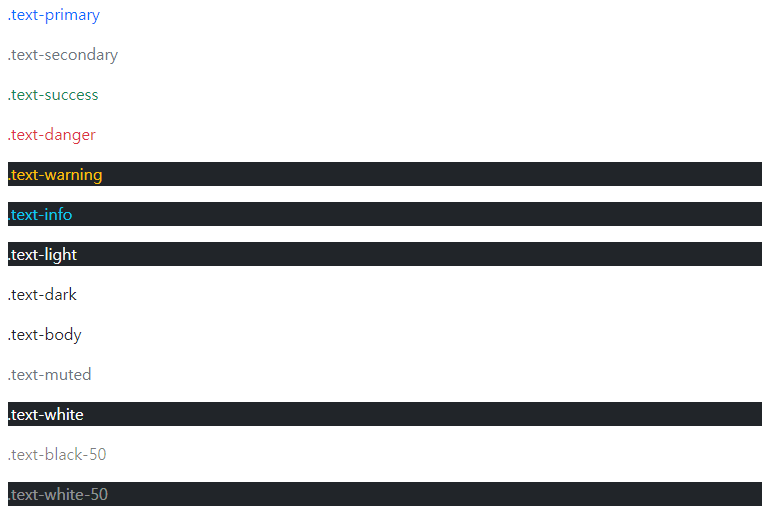
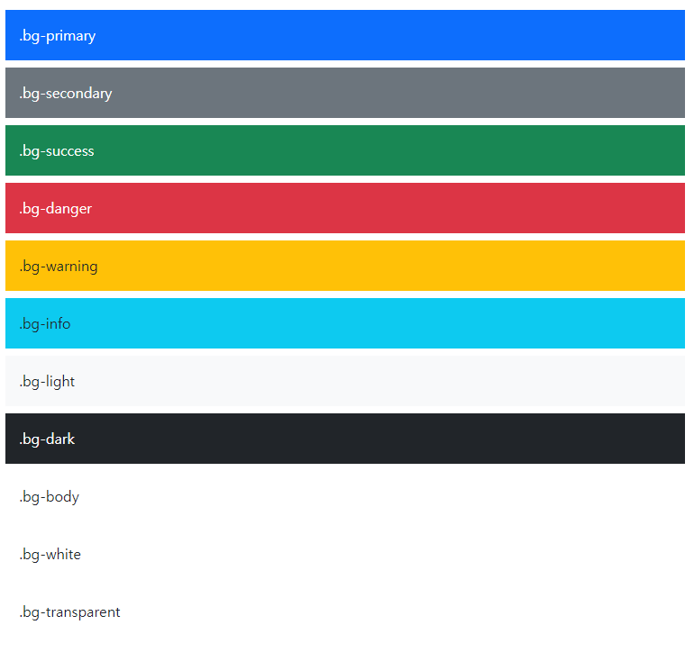

# Bootstrap

> The most popular HTML, CSS, and JS library in the world

- 트위터에서 시작된 오픈 소스 프론트엔트 라이브러리
- 웹 페이지에서 많이 쓰이는 요소 거의 전부를 내장
- 별도의 디자인을 할 시간이 크게 줄어들고, 여러 웹 브라우저를 지원하기 위한 크로스 브라우징에 불필요한 시간을 사용하지 않도록 함
- 하나의 코드로 여러 사용을 할 수 있음(one source multi use)


### CDN

- Content Delivery(Distribution) Network
- 컨텐츠를 효율적으로 전달하기 위해, 서버와 사용자 사이의 물리적 거리를 줄여 컨텐츠 로드 지연을 최소화
- 분산된 서버로 이루어진 플랫폼
  - 전 세계 사용자들이 로딩 시간을 늦추지 않고 동일한 품질의 컨텐츠 사용 가능
- 사용자와 가까운 서버를 통해 빠르게 전달 가능
- 외부 서버를 활용함으로써 본인 서버의 부하가 적어짐


### Grid System

- flexbox로 제작됨
- `container`, `rows`, `column`으로 컨텐츠 배치하고 정렬
  - 12개의 column, 6개의 grid breakpoints

- `row`
  - columns 의 wrapper
- gutters
  - grid 시스템에서 반응적으로 공간을 확보하고 컨텐츠를 정렬하는 데 사용되는 column 사이의 padding
- `col`, `col-*`
  - row당 가능한 12개 중 사용하려는 columns 수를 나타냄
  - 너비는 백분율로 설정되어 부모 요소를 기준으로 유동적으로 크기가 조정
  - grid layout에서 내용은 반드시 columns 안에 있어야 하며 오직 columns만 row의 바로 하위 자식일 수 있음


### Grid breakpoints

- 다양한 디바이스에서 적용하기 위해 특정 픽셀 조건에 대한 지점을 정해둠
- bootstrap은 대부분의 크기를 정의하기 위해 em 또는 rem 사용
  - px은 grid breakpoint에 사용
  - viewport 너비가 픽셀단위이고 글꼴 크기에 따라 변하지 않기 떄문


자세한 내용은 <https://getbootstrap.com/docs/5.0/getting-started/introduction/> 참조

### Spacing

- property
  - `m`: margin
  - `p`: padding
- sides
  - `t`: top
  - `b`: bottom
  - `s`: start(left)
  - `e`: end(right)
  - `x`: left and right
  - `y`: top and bottom
  - blank: 4 sides

- size
  - `0`
  - `1`
  - `2`
  - `3`
  - `4`
  - `5`
  - `auto`: margin을 `auto`로 설정

- 표기
  - `mx-3`, `pt-3`, `m-4`, `mx-auto` 등


### Color

- Text



```html
<p class="text-primary">.text-primary</p>
<p class="text-secondary">.text-secondary</p>
<p class="text-success">.text-success</p>
<p class="text-danger">.text-danger</p>
<p class="text-warning bg-dark">.text-warning</p>
<p class="text-info bg-dark">.text-info</p>
<p class="text-light bg-dark">.text-light</p>
<p class="text-dark">.text-dark</p>
<p class="text-body">.text-body</p>
<p class="text-muted">.text-muted</p>
<p class="text-white bg-dark">.text-white</p>
<p class="text-black-50">.text-black-50</p>
<p class="text-white-50 bg-dark">.text-white-50</p>
```


- Background



```html
<div class="p-3 mb-2 bg-primary text-white">.bg-primary</div>
<div class="p-3 mb-2 bg-secondary text-white">.bg-secondary</div>
<div class="p-3 mb-2 bg-success text-white">.bg-success</div>
<div class="p-3 mb-2 bg-danger text-white">.bg-danger</div>
<div class="p-3 mb-2 bg-warning text-dark">.bg-warning</div>
<div class="p-3 mb-2 bg-info text-dark">.bg-info</div>
<div class="p-3 mb-2 bg-light text-dark">.bg-light</div>
<div class="p-3 mb-2 bg-dark text-white">.bg-dark</div>
<div class="p-3 mb-2 bg-body text-dark">.bg-body</div>
<div class="p-3 mb-2 bg-white text-dark">.bg-white</div>
<div class="p-3 mb-2 bg-transparent text-dark">.bg-transparent</div>
```

