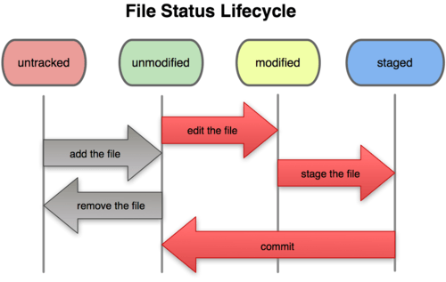
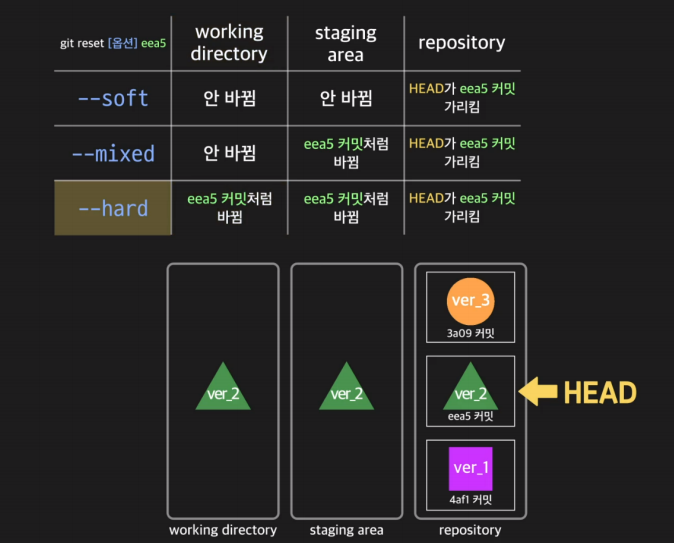

# Git & Github


#### Git 과 Github는 다른가?

- git은 버전 관리, github는 구글 드라이브와 같은 온라인 공간으로 볼 수 있다.


## Git

- 로컬 저장소, 분산형 버전 관리 프로그램이다.
  - 버전 관리 : 코드의 History를 관리
  - 분산 집중형(Distributed Version Control System)
- `git init`을 통해 repository 생성

- **Repository(저장소), Commit**
  - `.git` : repository, 버전 저장소(지우면 다 날라감)
  - commit : 버전 생성
  - commit message : 버전벌 변경 사항에 대한 설명


#### Git 초기 설정

- 커밋 작성자 설정

```
$ git config --global user.email "메일주소"
$ git config --global user.name "유저네임"
```


#### Git의 작업 흐름

- working directory(가수) , staging area(무대), commit(사진촬영)

1. 워킹 디렉토리(실제 폴더)에서 작업

2. `git add`를 통해 staging area로 작업한 내용을 올림

   - `git add .` 현재 디렉토리의 모든 파일 + 하위 디렉토리

   - `git restore --staged <file>` 을 통해 add로 올린 파일들을 내릴 수 있음
   - `git restore --staged all` 을 통해 모든 파일을 내릴 수도 있음

3. `git commit`을 통해 버전을 생성

   - `git checkout`을 통해 이전 commit 이동 가능
   - `git checkout master` 을 통해 마스터로 이동 가능

4. `git push`를 통해 github에 업로드

   - commit들이 기록되어 있는 곳에 생성된 커밋들 반영


#### 파일 라이프사이클

- Working Directory의 모든 파일은 특정 상태를 가지며, git 명령어를 통해 변경
- Tracked : 1번이라도 staging area에 올라간 것들
  - unmodified : 수정되지 않음
  - modified : 수정됨
  - staged : staging area에 있는 상태
- Untracked : 1번도 staging area에 올라간 적 없음



출처 : https://brunch.co.kr/@anonymdevoo/4


#### Github와 연결하기(push)

- github에서 repository를 생성
- `git remote add origin https://github.com/(id)/(repository_name).git` 입력
  - 로컬에서 `git remote -v` 로 연결이 잘 되었는지 확인 가능
- `git push` 로 연결
  - 처음 연결하는 경우 `git push --set-upstream origin master` 입력해서 연결하기
- git은 파일만 관리하기 때문에, 빈 폴더는 복사되지 않음


#### Github에서 불러오기 (pull)

- `git clone https://github.com/(id)/(repository_name).git`  (처음 1회만)
  - 맨 뒤에 `.`을 추가로 붙이면, repository 이름부터가 아닌 바로 내용들이 복사되어 들어옴
- 이후에는 `git pull` 


#### Tips

- `git status` 를 통해 untracked files 확인 가능
- `git log`를 통해 현재 커밋 상태 파악 가능
  - `git log --oneline` 커밋 목록 한 줄로 확인 가능
- log 내의 `origin`은 github에서의 상태를 말하고, `HEAD`는 로컬에서의 상태를 말함


### gitignore

- git으로 관리하고 싶지 않은 파일들의 리스트를 작성하여 git이 버전관리를 하지 않도록 하는 것
- 개발환경과 같은 파일들은 github에 올라가서는 안됨
- `.gitignore` 파일을 만들어서 관리
- [gitignore.io](https://gitignore.io) 페이지에서 기본적인 파일 생성 가능


### 자주 하는 실수

----

##### git 속 git

- Git 저장소 내부에 Git 저장소가 있는 경우
- submodule 방식으로 활용이 가능하지만, 복잡함

##### 경로 공백 처리

- 공백은 `_`로 활용하는 것이 좋고, 영어로 쓰는 것이 좋음

##### 약속 

- git 명령어는 항상 .git 폴더가 있는 곳에서 하기
  - `ls -al` 로 `.git` 있는지 확인하기
- git 저장소로 활용되는 폴더에 다른 git 저장소로 옮기지 않기

##### 커밋 없는 경우

- commit이 없는 경우, push를 할 수 없음


## Git Flow

- Git을 활용하여 협업하는 흐름으로 branch를 활용하는 전략을 의미함
- 정해진 답이 있는 것은 아님


#### Branch

- Master(main)
  - 뱊포 가능한 상태의 코드
- Develop(main)
  - fetch branch로 나뉘어지거나, 발생된 버그 수정 등 개발 진행
  - 개발 이후 release branch로 갈라짐
- feature branches(supporting)
  - 기능별 개발 브랜치(topic branch)
  - 기능이 반영되거나 드랍되는 경우 브랜치 삭제
- release branches(supporting)
  - 개발 완료 이후 QA/Test 등을 통해 얻어진 다음 배포 전 minor bug fix 등 반영
  - 다음 버전을 위한 것
- Hotfixes(supporting)
  - 긴급하게 반영해야 하는 bug fix
  - 현재 버전을 위한 것


#### 명령어 

- `$ git branch 브랜치명` 브랜치 생성
- `$ git branch` 브랜치 목록 확인
- `$ git checkout 브랜치명` 브랜치로 이동
  - `$ git checkout -b 브랜치명` 브랜치 생성 + 이동
- `$ git merge 브랜치명` 브랜치 병합
  - merge는 보통 master에서 많이 이루어짐
  - merge에서 conflict가 발생한다면, 무엇이 최신 버전인지 판단이 되지 않아 발생
    - 이 경우, 파일 수정 후 진행
- `$ git branch -d 브랜치명` 브랜치 삭제
  - `$ git branch -D 브랜치명` 브랜치 강제 삭제


#### Branch Merge

- fast-forward
  - 기존 master 브랜치에 변경사항이 없어 단순히 앞으로 이동
  - master branch로 병합
  - `$ git merge --no-ff 브랜치명` fast-fowarding 상황에서도 commit 발생
- merge commit case
  - 기존 브랜치에 변경사항이 있어 병합 커밋 발생
- conflict
  - 두 브랜치 사이에 동일한 파일에서의 차이점 발생
  - 파일에 접근해 내용 수정 이후 commit


#### git reset

- `$ git reset [옵션] [커밋아이디]`
  - `--soft`  HEAD가 과거의 특정 커밋을 가리키도록 한다. 
  - `--mixed` staging area를 과거의 특정 커밋의 내용과 똑같게 만든다.  (default)
  -  `--hard` working directory를 과거의 특정 커밋의 내용과 똑같게 만든다.

- `git log` `git log --oneline` 을 통해 커밋아이디 찾기
  - `git reflog` 를 통해서도 찾을 수 있음




## Github Flow


#### 기본 원칙

- master branch는 반드시 배포 가능한 상태여야 함
- feature branch는 각 기능의 의도를 알 수 있도록 작성
- Commit message는 매우 중요, **명확하게 작성하기**
- `Pull Request`를 통해 협업 진행
- 변경사항을 반영하고 싶다면, master branch에 병합


#### Github Flow Models

- Shared Repository Model (회사)
  - 동일한 저장소를 공유하여 활용하는 방식
  - 팀장: Repository Owner (Project Manager)
  - 팀원: Collaborator
- Fork & Pull Model (오픈소스)
  - 권한이 있는 사람은 따로 있음


#### 오류해결

- `git stash` pull, push 를 하기 전에 수정이 있을 경우, 위 명령어를 통해 해당 부분 임시 저장 가능
  - stack 구조로 되어있음
  - `git stash apply`를 통해 저장된 부분을 다시 불러올 수 있음 
    - conflict 발생하기 때문에, 수정해야함
- Github가 로컬보다 최신버전인 경우, 로컬에서 `git push`를 하면 오류발생
  - `git push -f` 강제로 push (권장하진 않음)
