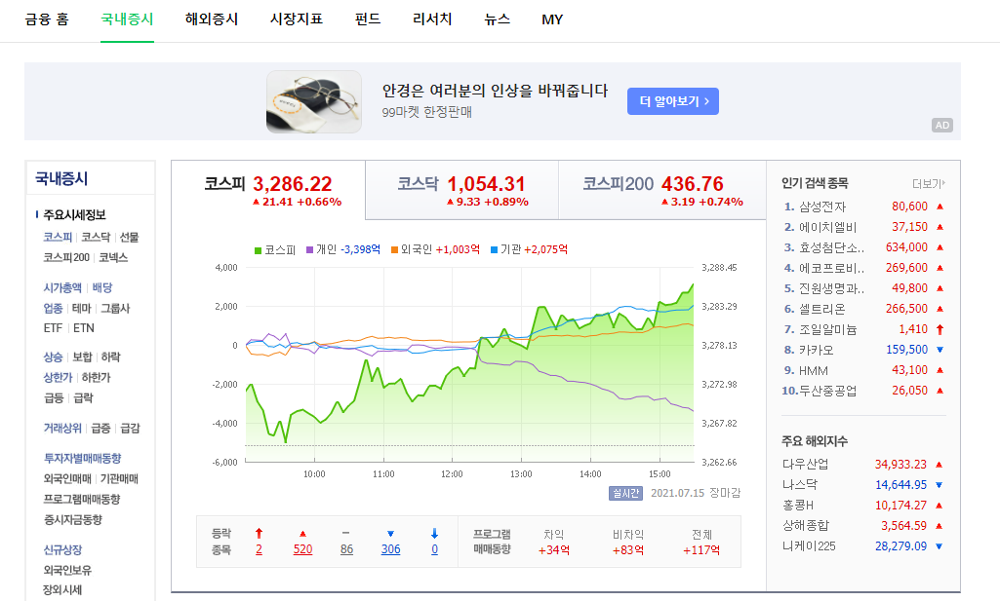

# 파이썬 웹 페이지 크롤링


#### 웹 크롤링(Web Crawling)이란?

> www(World Wide Web) 
>
> 조직적, 자동화된 방법으로 웹을 탐색하는 것


1. 요청을 해야 응답을 받을 수 있음
2. 필요한 부분만 자르는 것 : Parsing


#### 필요로 하는 패키지

- `requests` , `beautifulsoup4` 

```
$ pip install requests
$ pip install beautifulsoup4
```


#### 예시(네이버 국내증시에서 코스피 불러오기)

---------

[네이버 국내증시](https://finance.naver.com/sise/)  



- 위 페이지에서 `F12` 눌러 DevTools 창을 열고, `ctrl+shift+c` 를 활용해 원하는 값을 클릭
- `copy selector` 를 통해 복사


#### 예시코드(kospi.py)

```python
#라이브러리 가져오기
import requests 
from bs4 import BeautifulSoup

url = 'https://finance.naver.com/sise/'
response = requests.get(url).text #요청 보내고 받은 응답 text로 변환
data = BeautifulSoup(response, 'html.parser') #응답으로 받은 걸 처리하기 쉽게 가공(parsing)
kospi = data.select_one('#KOSPI_now')
result = kospi.text

print(f'현재 코스피 지수는 {result}입니다.')

```

