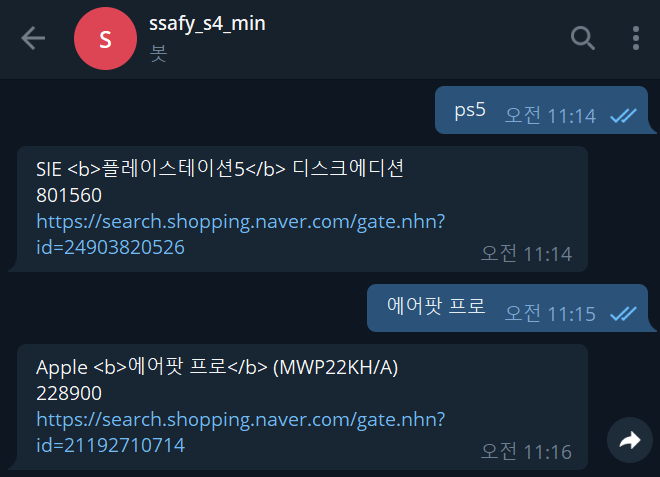

## 텔레그램 봇 활용하기

- 텔레그램에서 `@BotFather` 검색
- 본인의 TOKEN 확인하기
- 텔레그램 API URL <https://api.telegram.org/botTOKEN/METHOD_NAME> 활용
- <https://core.telegram.org/bots/api#available-methods> 에서 자세한 내용 파악


#### telegram_send_message.py

```python
import requests

#기본 설정
TOKEN = ''
APP_URL = f'https://api.telegram.org/bot{TOKEN}'

#chat_id 가져오기
UPDATES_URL = f'{APP_URL}/getUpdates'
response = requests.get(UPDATES_URL).json()

chat_id = response.get("result")[0].get('message').get('chat').get('id')
print(chat_id)

text = '파이썬으로 보낸 메세지입니다.'

message_url = f'{APP_URL}/sendMessage?chat_id={chat_id}&text={text}'

requests.get(message_url)
```


## 네이버 검색 API 활용하기

- <https://developers.naver.com/main/> 에서 내 어플리케이션 등록
  - 이후 고유의 네이버 client id, client secret 파악하기


#### naver_search.py

```python
import requests

# naver 요청 보낼 때 필요한 것들(채워야함)
naver_client_id = ''
naver_client_secret = ''
#URL
URL = 'https://openapi.naver.com/v1/search/shop.json?query='

headers = {
    'X-Naver-Client-Id': naver_client_id,
    'X-Naver-Client-Secret': naver_client_secret
}

#검색하고자 하는 내용
query = ''

#가장 첫번째 내용 꺼내오기
product = requests.get(URL+query, headers=headers).json()['items'][0]
product_name = product['title']
product_price = product['lprice']
product_link = product['link']

message = f'{product_name}\n{product_price}\n{product_link}'
print(message)

```


## 텔레그램 봇 활용하여 상품 결과 도출하기

- 위에 작성한 `telegram_send_message.py` 내용, `naver_search.py` 내용 합치기


#### telegram_search.py

```python
import requests

#기본 설정
TOKEN = ''
APP_URL = f'https://api.telegram.org/bot{TOKEN}'

#chat_id 가져오기
UPDATES_URL = f'{APP_URL}/getUpdates'
response = requests.get(UPDATES_URL).json()

chat_id = response.get("result")[0].get('message').get('chat').get('id')

# 검색하고자 하는 단어(가장 마지막 단어)
need_to_search = response.get("result")[-1].get('message').get('text')

print(need_to_search)


##### 네이버 서치

# naver 요청 보낼 때 필요한 것들
naver_client_id = ''
naver_client_secret = ''
URL = 'https://openapi.naver.com/v1/search/shop.json?query='

headers = {
    'X-Naver-Client-Id': naver_client_id,
    'X-Naver-Client-Secret': naver_client_secret
}

query = need_to_search

product = requests.get(URL+query, headers=headers).json()['items'][0]
product_name = product['title']
product_price = product['lprice']
product_link = product['link']

message = f'{product_name}\n{product_price}\n{product_link}'
print(message)


text = message

message_url = f'{APP_URL}/sendMessage?chat_id={chat_id}&text={text}'

requests.get(message_url)
```



